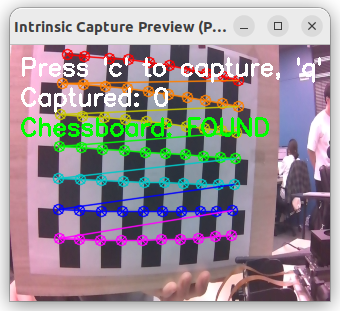
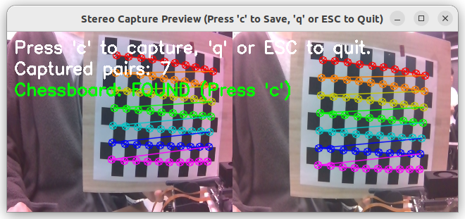
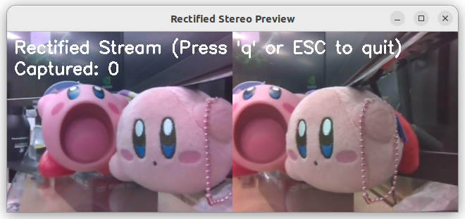

# Calibration

## Intrinsic Calibration

❗️**LEFT: 1, RIGHT: 0**❗️

왼쪽 카메라 Intrinsic Calibration
```bash
python3 intrinsic_capture.py --cam_id 1 # Left
```


`C`를 누르면 캡쳐가 되고, `Q`를 누르면 종료 및 캘리브레이션 실행
다양한 거리, 각도로 캡쳐하여 최소 20장의 사진을 취득하세요.

완료 되었으면, 반대쪽도 마찬가지로 캘리브레이션을 수행하세요.
```bash
python3 intrinsic_capture.py --cam_id 0 # Right
```

## Extrinsic Calibration

아래 명령어를 실행하여 extrinsic calibration을 완료하세요.
```bash
python3 stereo_capture.py
```



## Rectification

캘리브레이션이 성공적으로 완료되었는지 확인하세요.
아래 명령어로, rectify된 이미지를 실시간으로 확인할 수 있습니다.
```bash
python3 stereo_preview.py
```

아래 명령어로 이미 저장된 이미지를 rectify할 수 있습니다.
파일을 열어 이미지가 있는 경로를 수정하세요.

```bash
python3 rectify_images.py 
```
